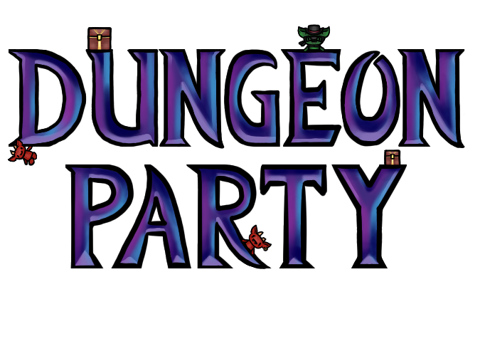
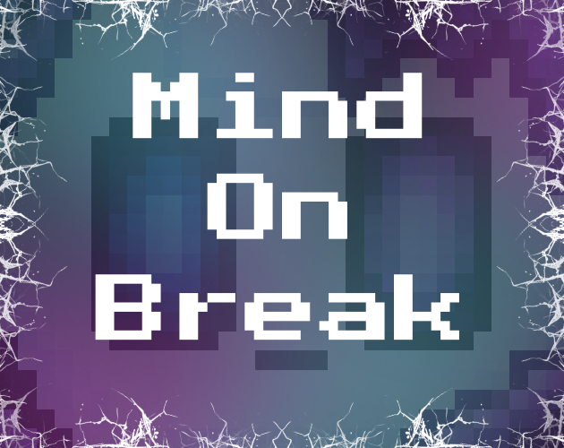
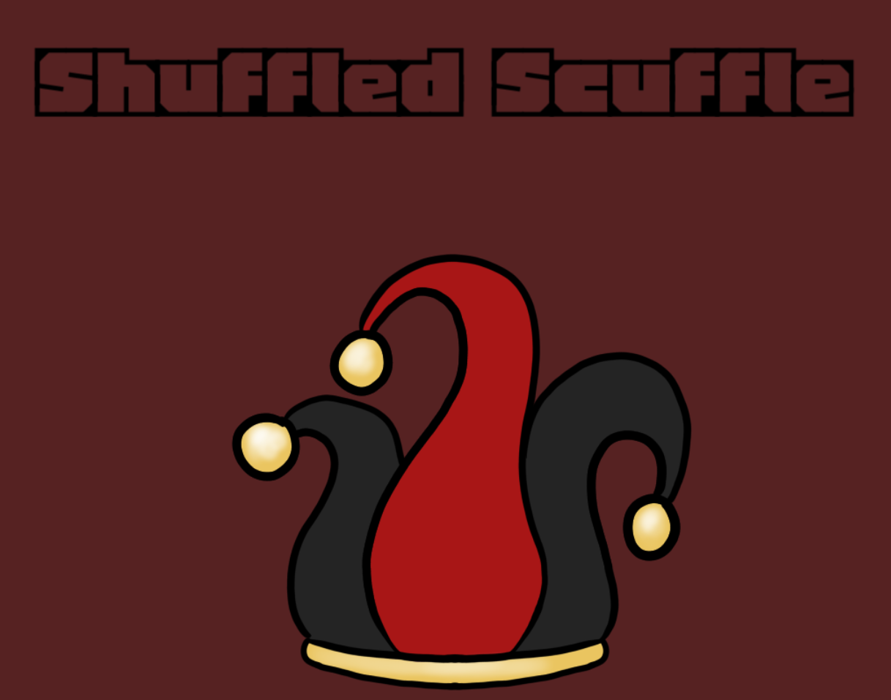
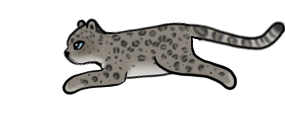

[About Me](/index.md/) | [Projects](/Projects.md/) | [Art](/Art.md/) | [Resume](/Resume.md/) 
 
<h1 align="center"> Dungeon Party </h1>
 

## Description: An online multiplayer game designed for groups of 4 - 15. Dungeon Party is a team focused, web-based, party game inteded to be accessible for people of varying experience levels and financial standing. The game consists of an overworld that players can strategically navigate as well as minigames that allow for skill expression and foster team collaboration. 
## Contribution: Programmed the majority of the overworld and created/animated all of the visual assets
### Keywords: Game, Multiplayer, Team-Focused
### [Game Link](https://dungeonpartyust.netlify.app/)

# Mind On Break

## Description: A game focused on the impacts of maladaptive day dreaming. Mind On Break is a RPG where the user plays as a person working at a burger shop. They do not enjoy their work there and often begin to day dream. During these day dreams, the player gets to be a robot. This robot has broken out of their programming and can do whatever they want. During the daydreams, the player uses their microphone to interact with the world. By using different volume levels of sound, they can solve puzzles, win combats, and progress through the game. But, their time spent in the dream can negatively effect their real life. The player must choose between being successful in the dream or successful in the real world. 
## Contribution: All
### Keywords: Game, RPG, Puzzle, Microphone
### [Game Trailer](https://youtu.be/tK_elxOnCCc)

# Shuffled Scuffle

## Description: A game made for a week long game jam with the theme "Random Chance". In this game, the player can use a slot machine to determine their character build. It takes tokens to run the machine so they cannot infinitely spin it. The slot machine gives effects such as double jump, increased melee damage, etc. With these effects, the player then enters a combat. Every round exponentially more enemies spawn in, each one killed increases the player's score and gives them tokens. The player's goal is to get as high of a score as possible. 
## Contribution: All
### Keywords: Game, Combat, Random Chance
### [Game Link](https://tiylergratz.itch.io/shuffled-scuffle)

# Ghost of the Mountain

## Description: A game intended to inform users on the current state of the snow leopard population. The user plays as a snow leopard in a platformer representing a mountain. The player must hunt and eat goats in order to survive. With every passing day, humans begin to show up in the mountains. They build farms, lower the wild goat population, and see snow leopards as threats. When a human sees a snow leopard, they will shoot and try to kill them. The player must explore and get food while avoiding getting killed by the humans. This game mirrors how in real life, snow leopard populations are in danger due to humans moving into their territory and then killing snow leopards when they hunt lifestock.
## Contribution: All
### Keywords: Game, Platformer, Snow Leopard, Inform

